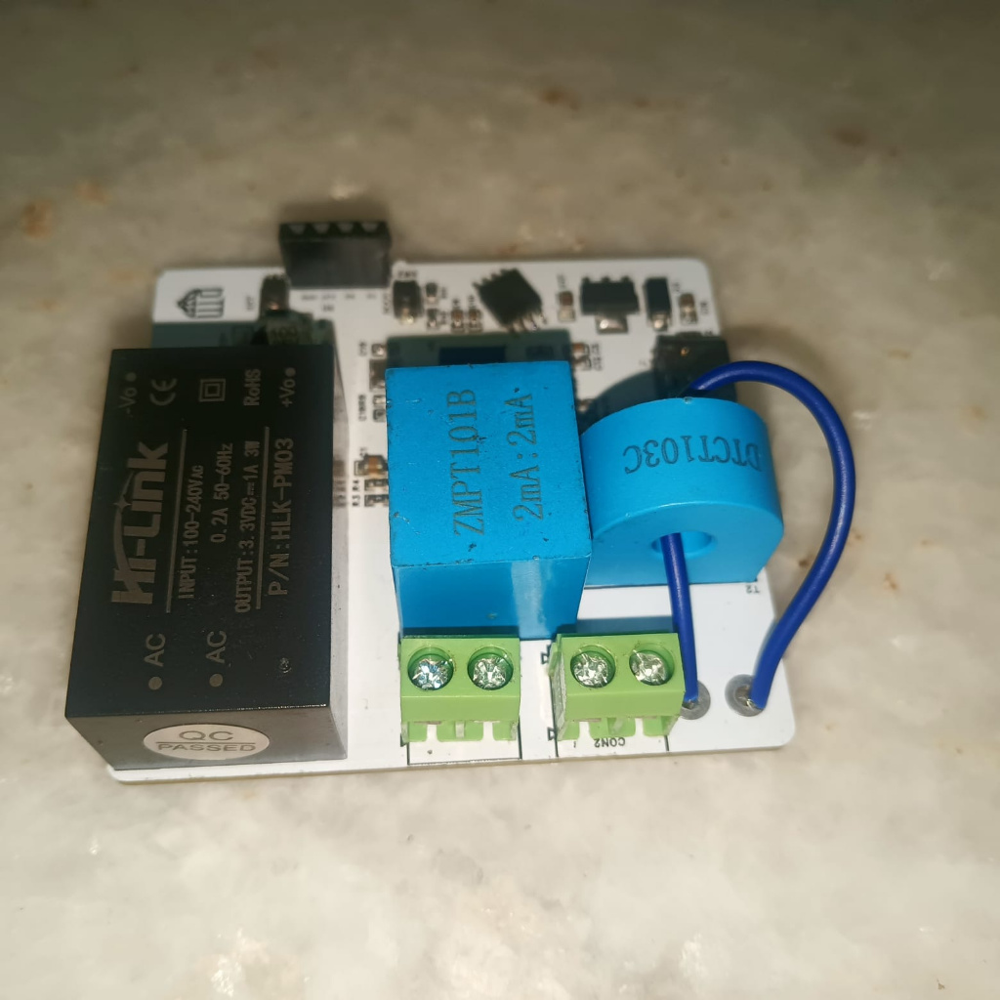
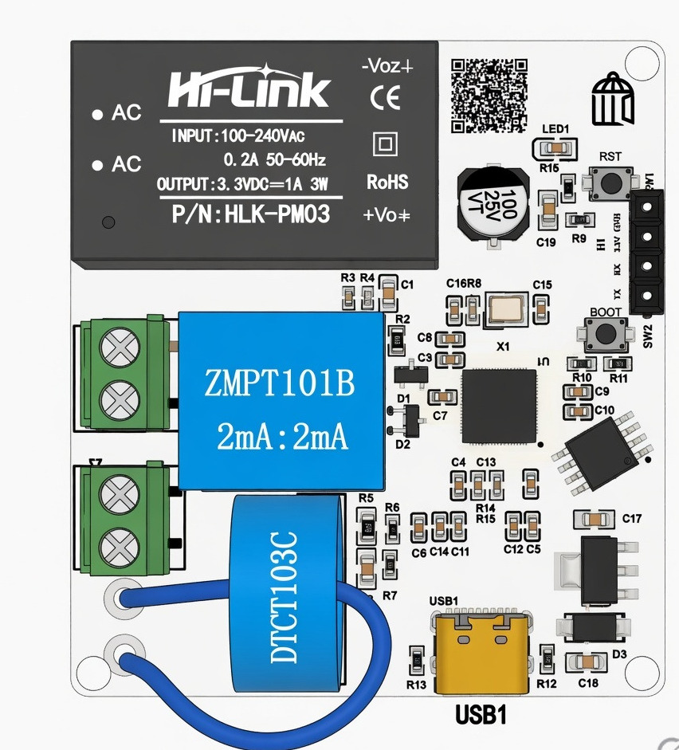
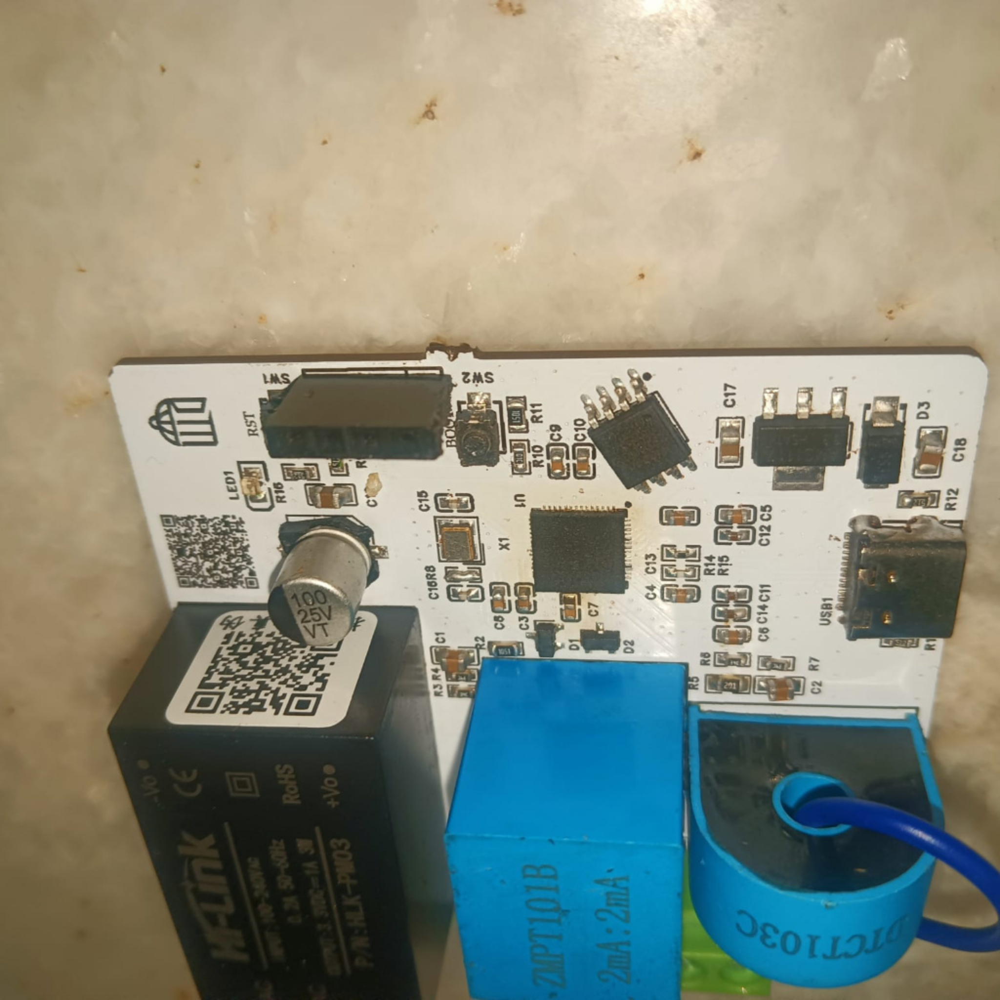
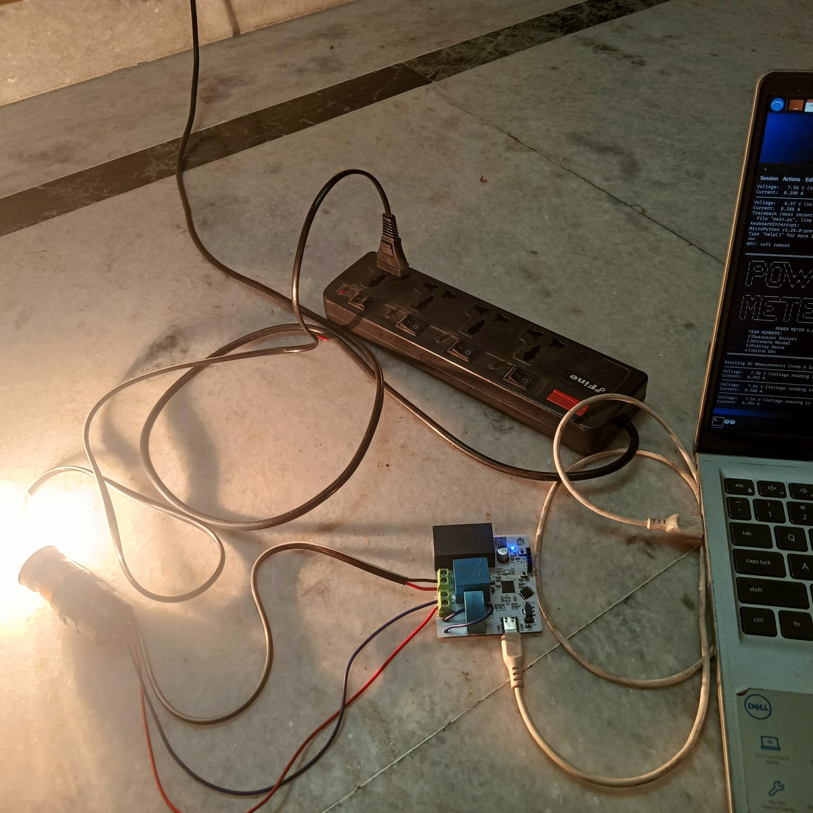
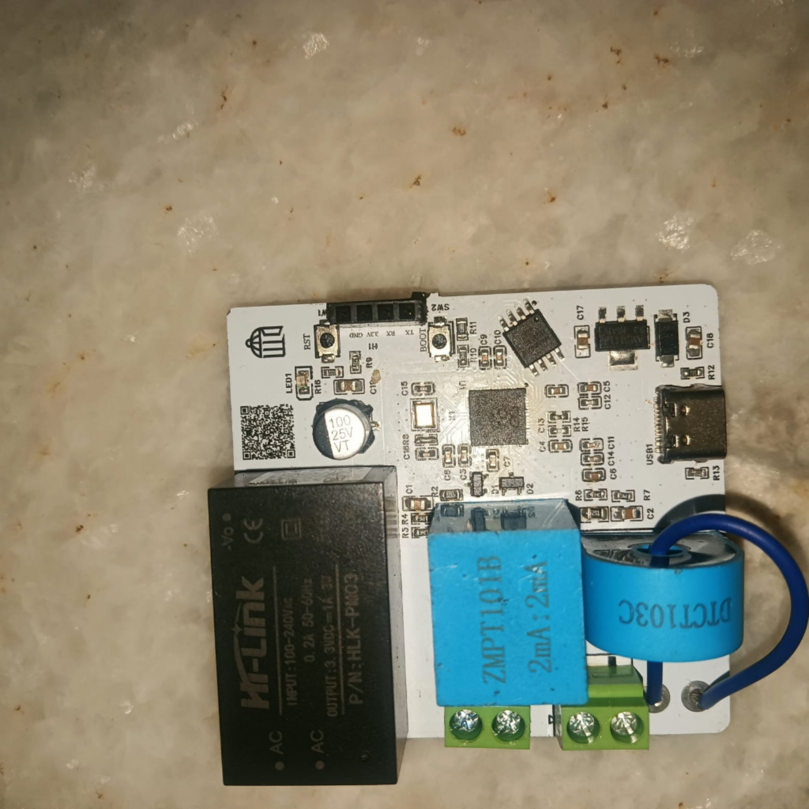
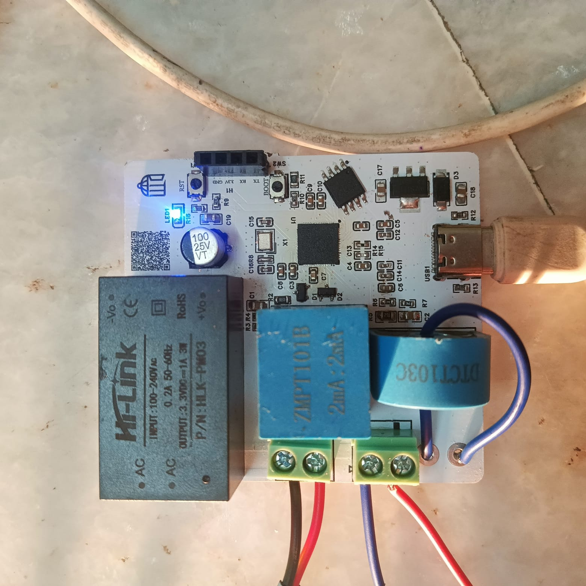
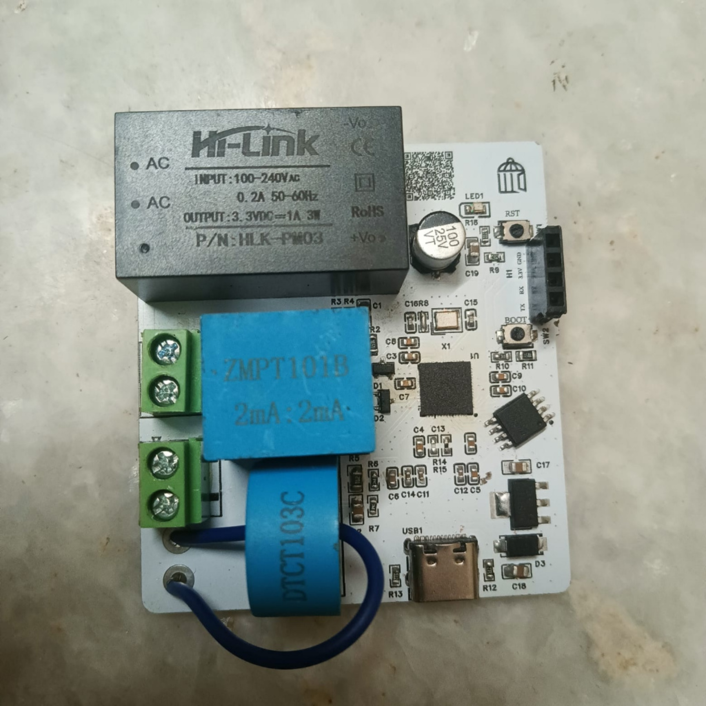
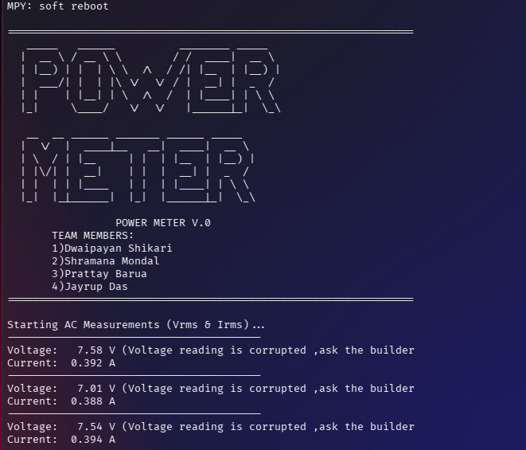

# Power Meter V.0

[](https://oshwa.org/)
[](https://micropython.org/)
[](https://www.raspberrypi.com/products/raspberry-pi-pico/)
[](https://ohwr.org/cern-ohl)

An AC power meter project that measures RMS current, frequency, and THD using MicroPython on a Raspberry Pi Pico.



## Hardware

| Component | Description |
|-----------|-------------|
| Raspberry Pi Pico | Microcontroller |
| ZMPT101B | AC Voltage Sensor (GPIO 26) |
| ZMCT103C | AC Current Sensor (GPIO 27) |

**Schematic:** [View PDF](Designs/schematic.pdf)



## Firmware

Written in MicroPython. Samples at 5 kHz (500 samples per reading) and computes RMS values after DC offset removal.

### Features

- **RMS Current** measurement
- **Frequency** detection via zero-crossing
- **THD** (Total Harmonic Distortion) via FFT analysis
- Real-time serial output

### Calibration Factors

- `ICAL = 16.667 / 3` — Current calibration

### Usage

Flash `Firmware/main.py` to the Pico and monitor via serial REPL.

## Project Structure

```
Hardware/
├── Designs/        # Schematic (schematic.pdf), EasyEDA project (rp.eprj), Gerber files (power.zip)
├── Docs/           # Project report and documentation
├── Firmware/       # MicroPython source (main.py)
├── Models/         # 3D renders, photos, and enclosure PDFs
└── README.md       # This file
```

## Gallery

| 3D Renders | Test Setup |
|------------|------------|
|  |  |
|  |  |
|  |  |

## License

This project is certified [Open Source Hardware](https://oshwa.org/definition/) under the [CERN Open Hardware License v2.0](https://ohwr.org/cern-ohl).

[](https://oshwa.org/)
